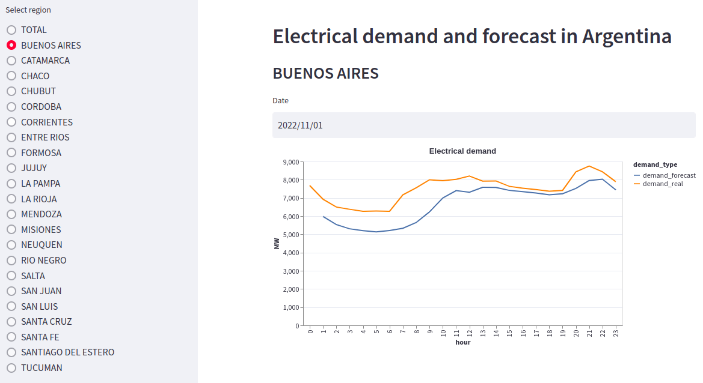

# Argentine electricity demand forecast



This project uses machine learning to obtain a model that allows us to forecast electricity demand in Argentina. This information is important to make a schedule for each generation plant. CAMMESA (Argentine Wholesale Electricity Market Clearing Company) makes its own predictions for this reason.

The `python` package `electrical_demand` was created using [poetry](https://python-poetry.org/) to run the whole process. This package was installed in an [docker](https://docs.docker.com/) image which is used by [Airflow](https://airflow.apache.org/). Airflow is in charge of orchestrating all the tasks. Finally, everything was deployed on [AWS](https://aws.amazon.com/) using [Terraform](https://www.terraform.io/).

## Dataset

There is no predefined dataset with the information needed to train a model. That is why it was necessary to create it from scratch. Three different sources were used:

    - Temperature historical and forecast: [Servicio Meteorológico Nacional (Argentine National Weather Service)](https://www.smn.gob.ar/descarga-de-datos)
    - Electrical demand:
        - Current: [API Camessa](https://api.cammesa.com/demanda-svc/swagger-ui.html#/)
        - Historical: [Informe Mensual Octubre 2022 (Monthly report October 2022)](https://cammesaweb.cammesa.com/informe-sintesis-mensual/)
    - Holidays: [Official Website of the Argentine Government](https://www.argentina.gob.ar/)

All data must be cleaned to get a useful dataset. To do this, a python package called `electrical_demand` was developed.

An abstract class `BaseApi` was created to get a connection to the data sources. For each of the data sources, a specific class (`ForecastSMNApi`, `HistoricalSNMPApi`, `DemandByDateByRegionApi`) was developed. Each has an associated `S3 bucket` where the data is uploaded as a csv by date after it is downloaded and processed. These classes implement an `etl` method that with the right arguments does all the work.

To process and load to `S3` the historical demand data and the holiday data are used two python functions: `load_historical_demand` and `load_holidays`.

## Raw data

The historical temperature data is presented in a txt file per date. The format is as follows:

    ```
    FECHA     HORA  TEMP   HUM   PNM    DD    FF     NOMBRE                                             
            [HOA]  [ºC]   [%]  [hPa]  [gr] [km/hr]                                                     
    01012019     0  25.5   72  1011.0   70   19     AEROPARQUE AERO                                     
    01012019     1  25.9   64  1010.6   70   19     AEROPARQUE AERO                                     
    01012019     2  25.4   67  1010.4   70   19     AEROPARQUE AERO                                     
    01012019     3  24.7   71  1010.5   50   20     AEROPARQUE AERO                                     
    01012019     4  24.1   75  1010.2   50   17     AEROPARQUE AERO                                     
    01012019     5  23.7   80  1010.8   70   17     AEROPARQUE AERO                                     
    ·
    ·
    ·
    ```

The forecast data is also a txt file per date. It has the temperature forecast every three hours for the next five days. The format is as follows:

    ```
    ************************************************************************************************
    Producto basado en un modelo de pronóstico numérico del tiempo, 
    por lo tanto puede diferir del pronostico emitido por el SMN
    ************************************************************************************************

    AEROPARQUE
    ================================================================================================
        FECHA *          TEMPERATURA      VIENTO      PRECIPITACION(mm)
                                        (DIR | KM/H)                        
    ================================================================================================
    01/ENE/2019 00Hs.        22.1        73 |  10         0.0 
    01/ENE/2019 03Hs.        21.4        52 |   9         0.0 
    01/ENE/2019 06Hs.        19.9        57 |   7         1.3 
    01/ENE/2019 09Hs.        22.2        47 |  10         3.2 
    01/ENE/2019 12Hs.        28.6        60 |   9         1.7                                
    ·
    ·
    ·
    ```

The historical demand data is in a table in an Excel file. The cleaning process is straight forward using the function `load_historical_demand`.

The current demand data is obtain from the CAMMESA Api. It gives a list of `json` objects as follows. The `temp` field is discarded:

    ```
    [
    {
        "fecha": "2022-11-25T00:05:00.000-0300",
        "dem": 2544
    },
    {
        "fecha": "2022-11-25T00:10:00.000-0300",
        "dem": 2566
    },
    {
        "fecha": "2022-11-25T00:15:00.000-0300",
        "dem": 2475,
        "temp": 11.3
    },
    {
        "fecha": "2022-11-25T00:20:00.000-0300",
        "dem": 2540
    },
    ·
    ·
    ·
    ```

## S3

S3 is used to store all the raw data. Historical temperature, forecast temperature, and current demand data are stored using date partitioning. There is a folder per year and per month. There are four buckets in total: temperature forecast, temperature historical, demand and general.

## Database

A `Postgres` database is used to store the data needed for the model. It has a single database with a single table called `demand`. It has the follow fields: `id`, `datetime`, `region`, `demand`, `demand_forecast`, `day_type`, `temperature` and `temperature_forecast`. `Alembic` is used to create the table based on a `sqlalchemy` table model. Some python functions were developed to load the data from S3 into the database. The result of the machine learning process is also loaded into the same table. The table is designed to allow upserts so that we can modify each row at each step of the upload process.

To consume the database there is a python api developed using `FastApi`. It returns the demand data for a specific date and region. The code is part of the `electrical_demand` package.

## Machine Learning

The machine-learning model is base in the `scikit-learn` [documentation](https://scikit-learn.org/stable/auto_examples/applications/plot_cyclical_feature_engineering.html).

For each region, a weather station was selected. This data is save in `data/regions.json`. Using a local notebook were tested all the alternatives and one was chosen because it has the lower error and smooth response.

## Dashboard

The data can be consulted by region and date through a dashboard. This was created using the `Streamlit` python library. Streamlit allows us to develop a dashboard using code, so it can be easily replicated. It uses `api_database` to consume the database. The code is part of the `electrical_demand` package.

## Docker

The `electrical_demand` python package was installed in a Docker image so that Airflow can run the different tasks. Two other images derived from this are created to be used in `api_database` and `dashboard`. In both, it only changes the working directory and execute the services.

## Airflow

Airflow is in charge of run all tasks. There are two dags:

- data_preparation_dag: it creates the table in the database, loads the historical data to S3 and the database and runs the machine learning process. It has to be run only one time.
- new_data_dag: it runs once a day to apply any change in the database model, download the new data and made the new forecast values of the demand. Each time it is called it trains again the model.

All tasks run inside a docker container using an image where `eletrical_demand` is installed. This was a design decision to separate the task environment and the Airflow environment.

The airflow-web-server is available for the developer to enter and run and monitoring the dags.

## AWS

All the infraestructure needed is built in AWS. The airflow run in an EC2 using docker-compose. The volume size (30 gb) and the type (t2.large) were selected to properly execute Airflow and Docker. The same docker-compose runs the database api and the dashboard as a separate containers. The database is an RDS.
There are a VPC with public subnet for the EC2 and two privates ones for the databse. The VPC has an S3 endpoint to avoid going through internet to download the data. ECR is used to store the `electrical_demand` docker image.
To restric the access to the resources were used security groups. The database only can be acceded from inside the VPC and the Airflow server can be accede from inside the VPC and from the developer IP.

## Terraform

Terraform is used to build the entire infrastructure on AWS and to build the docker image where the `electrical_demand` python package is installed. It also configures the airflow service and runs it.

When the build is complete, terraform outputs the URL of the Airflow web server and the dashboard.

## Instructions

Follow this steps to run the app:

1. Complete the blank environment variables in the .env file.

2. Allow permissions to docker sock (not recommend in production environments)
    ```
    sudo chmod 666 /var/run/docker.sock
    ```
3. Save the aws credentials in [~/.aws](https://docs.aws.amazon.com/cli/latest/userguide/cli-configure-files.html#cli-configure-files-where)

4. Save the `.pem` file with the ssh keys in `~/Downloads/keys.pem`.
5. Create the AWS infrastructure and the Docker images:
    ```
    cd terraform/
    terraform init
    terraform apply --auto-approve
    ```
6. Use the terraform output to enter the airflow-web-server and run the preparation_dag
7. When it is completed run the new_data_dag
8. Use the terraform output to enter in the dashboard and see the forecast

## To do

- Add docstrings
- Add decorators to abstract methods and abstract classes
- Add `black` and `pylint` with `pre-commit`
- Add error handling to database_api
- Use sagemaker to study different machine learning models
- Use Athena to analice the quality of the raw data
- Replace SQL query in favor of Sqlalchemy code
- Add data quality check steps in the airflow dags to avoid missing data
- Add python tests with pytest and implement with github actions
- Inprove use of enviroment variables
- Use IAM profiles to avoid copy the credentials into the EC2
- Save `alembic` versions to a persistent storage device